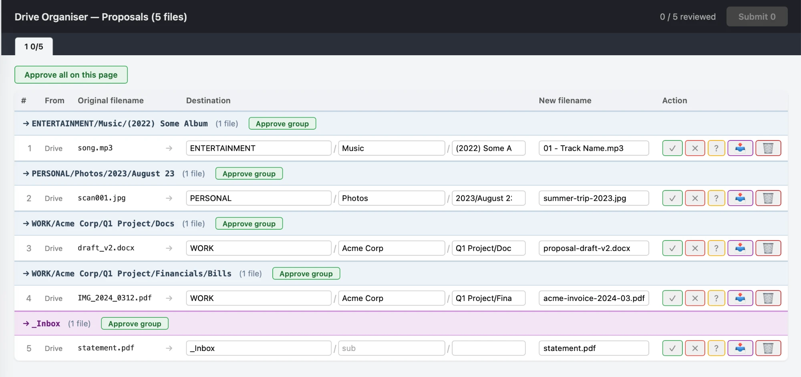

# Drive Organizer

## What this skill does

Drive Organizer sorts the files on a drive — cloud-synced (OneDrive, iCloud, Dropbox, Google Drive), external, or local — into a nested folder structure of top-level groupings (by default ENTERTAINMENT, PERSONAL, WORK, EDUCATION, RESOURCES — the set is user-configurable) that *you* define and that the skill *learns* from your corrections over time. It reads file content (and images, via vision) to decide where each file belongs, proposes a destination + a clean filename for every file, and lets you approve or correct them in a browser before anything moves. A Python backend keeps a SQLite registry (mirrored to a human-readable CSV) so nothing is ever lost and duplicates are caught across batches.



Concrete use cases:

- **Rolling batch organise** — trigger: "organise my drive" / `/drive-organizer` → steps: scan a 250-file/20GB batch, classify each file via the cascading-Q model, review proposals in the browser viewer, execute the approved moves, clean up empty folders, repeat → result: an inbox-zero drive sorted into your taxonomy.
- **Reconcile a drifted structure** — trigger: "my folders got messed up" / `/drive-organizer reconcile` → steps: detect misplaced files, stale registry rows, and a mangled folder tree; report everything; apply fixes only on confirmation → result: the on-disk + registry state realigned to your intended structure.
- **Find and co-locate duplicates** — trigger: "find duplicates" / `/drive-organizer duplicates` → steps: group byte-identical files, keep the best-named copy, place the others beside it suffixed `_dupN` → result: duplicates sitting next to their original for easy visual checking.

## Intent

This skill exists to route files **into a folder taxonomy the user has designed**, not to invent one. That is the load-bearing design choice and what separates it from every off-the-shelf organiser: AI organisers generate their own categories; rule engines can't read content. Drive Organizer does neither — it classifies by content *and* respects a fixed, user-evolved structure.

It deliberately prioritises, and a fix that trades any of these away should be surfaced for human judgment rather than applied automatically:

- **Human approval + a learning loop over full automation.** Every file passes a browser review; approvals with edited destinations teach new rules. Speed is sacrificed for correctness and for the structure staying *the user's*.
- **Semantic classification (vision + content-entity matching) over pure rule-matching.** Most of the real library is generically-named (photos, scans, RAW); routing depends on content and parent-folder context, which mechanical rules cannot resolve.
- **Safety over speed.** Files are never deleted (only moved to staging); destructive operations (reconcile `--apply`, duplicates) are dry-run-then-confirm; every mutation mirrors to a CSV the user can audit.
- **A user-defined, evolving taxonomy over a fixed preset.** Rules live in per-folder `.tidy-rules.json` files that grow lazily; the shipped skill is a bare skeleton each user grows into their own structure.

## When to use / When NOT to use

**Use when:** you have a drive (cloud-synced, external, or local) with many unsorted files and a target folder structure you want them sorted *into*; you want to review/correct classifications before files move; you need to detect duplicates or variant files (e.g. plain vs highlighted PDF); or your organised structure has drifted and needs reconciling.

**Don't use when:** you want a tool to *invent* a folder structure for you with zero setup (use an AI auto-organiser instead — this skill routes into *your* taxonomy); you need fully-unattended sorting with no review step (this is human-in-the-loop by design); or you only need a one-off move of a handful of files (just move them — the batch machinery is overkill).

## How to install

**Claude Code:** copy this folder to `~/.claude/skills/drive-organizer/`. On first run the skill installs its Python backend to `~/.claude/drive-organizer/organizer.py` automatically. Point it at your drive once: `python3 ~/.claude/drive-organizer/organizer.py --root /path/to/your/drive status`. The default root is your OS's OneDrive sync folder — `~/Library/CloudStorage/OneDrive-Personal` (macOS), `%USERPROFILE%\OneDrive` (Windows), or `~/OneDrive` (Linux); override with `--root` to point at any cloud or local drive. Cloud-placeholder detection is verified on macOS; Windows/Linux are best-effort.

**Cowork / Claude Desktop:** zip the `drive-organizer/` folder and add it via **Settings → Capabilities → Skills**.

**Requirements:** Python 3.9+ (standard library). Optional: `mutagen` (audio metadata), `PyMuPDF` (PDF annotation merge), `organize-tool` (reconcile drift cross-check), `Pillow` (image EXIF metadata for vision-off routing) — `pip3 install --user --break-system-packages mutagen pymupdf organize-tool pillow`.

(Not yet on a marketplace — install manually as above; a `claude plugins install` command will replace this once published.)

## How to invoke

- Slash command: `/drive-organizer` (no subcommand = backend check + status + scan), or a subcommand: `status`, `scan`, `propose`, `generate-viewer`, `process-return`, `execute`, `cleanup`, `reconcile`, `duplicates`, `variants`, `merge`, `flagged`, `csv-export`, `rules`, `rules-viewer`, `bootstrap`, `exif`, `merge-category`, `folder-tree`, `download-batch`.
- Natural language: "organise my drive", "sort these files into folders", "my folder structure got messed up — fix it", "find duplicate files", "show me the folder tree", "set up rules from my existing folders" (`bootstrap`), "edit my routing rules" (`rules-viewer`).
- Cowork / headless review: `/drive-organizer generate-viewer --static` (or set `DRIVE_ORG_HEADLESS=1`) writes an editable static review file instead of the localhost viewer; `--no-open` runs the server without auto-opening a browser.

Example:
```
/drive-organizer
→ verifies the backend, confirms the active root, scans a 250-file batch,
  classifies each file, and tells you "247 files classified, 10 pages — say
  'launch the viewer' when ready to review."
```

## Features & modes

**Main batch loop** — the core workflow that fills, classifies, reviews, and moves a batch of up to 250 files / 20 GB. Trigger: `/drive-organizer` (no subcommand), or "organise my drive" / "sort these files into folders". Runs scan → propose → generate-viewer → process-return → execute → cleanup in a repeating loop until the drive is sorted.

- **scan** — fills the next batch by priority (rules-bearing folders first, then loose root files, then unruled folders). Cloud-only files are downloaded in a batch: scan selects the whole batch first, then kicks every selected download up front and polls the set once, so the network waits overlap each other and the hashing. Reports new files, duplicates, and the batch stop state. Trigger: `/drive-organizer scan`.
- **propose** — classifies the scanned batch via the cascading-Q model (Q1 top-level grouping → Q2 thing inside → Q3 functional area → Q4 leaf type), fanning out to one sub-agent per 25 files. Deterministic rule matches are fast-pathed. Trigger: `/drive-organizer propose`.
- **generate-viewer** — serves a paginated browser UI (localhost:5002) of every proposed move + filename, grouped by destination; approve / reject / flag / inbox / delete, and edit destinations and filenames inline. Trigger: `/drive-organizer generate-viewer`, or "launch the viewer". **Cowork / headless** (`--static`, or `DRIVE_ORG_HEADLESS=1` / auto-detected Cowork env): instead of the localhost server it writes an editable static review file (`proposals_review.html`) plus a pre-filled `proposals_approved.json` — review/edit and Download, or accept-all unattended, then continue to process-return. `--no-open` runs the server without auto-opening a browser.
- **process-return** — processes the viewer submission: learns rules from edited approvals, reclassifies rejections against the updated rules, peeks flagged files, and prepares the next batch. Trigger: `/drive-organizer process-return`, or "I've submitted" / "done reviewing".
- **execute** — moves approved files, updates the registry, widens project date ranges, and routes delete-marked files to `Archive/_To Delete/` (never permanently deleted). Trigger: `/drive-organizer execute`.
- **cleanup** — removes empty directories left after execute; `cleanup --evict` additionally dehydrates the organised grouping folders to online-only to free local disk (per-OS, best-effort). Trigger: `/drive-organizer cleanup`.
- **reconcile** — maintenance: detects misplaced files, stale registry rows, and mangled root folders; dry-runs by default; applies fixes per-file (`--restore`/`--accept`/`--prune`) or in bulk (`--apply`). Trigger: `/drive-organizer reconcile`, or "my folder structure drifted".
- **duplicates** — groups byte-identical files by SHA256, suggests a keeper, and co-locates extra copies beside it renamed `_dupN` (nothing deleted). Trigger: `/drive-organizer duplicates`, or "find duplicates".
- **variants** — groups similarly-named same-extension files as probable variants (e.g. plain vs highlighted PDF); pick per group: merge, keep one, or skip. Trigger: `/drive-organizer variants`.
- **merge** — combines annotations (highlights, comments, sticky notes) from variant PDFs into one canonical copy via PyMuPDF; originals move to `Archive/_Merged-Originals/`. Trigger: `/drive-organizer merge --group GROUP_ID --canonical FILE_ID`.
- **status** — shows the active drive root and registry counts by status. Trigger: `/drive-organizer status`, or runs at session start.
- **flagged** — lists files marked `?` in the viewer, peeks their content, reclassifies them, and queues them for the next viewer pass. Trigger: `/drive-organizer flagged`.
- **rules / rules-viewer** — `rules` prints a clustered per-entity summary (`--json` feeds the viewer); `rules-viewer` opens a full browser editor (port 5003) with per-entity CRUD, alias management, conflict warnings, test-a-file, coverage gaps, and area add/rename/remove. It also has a **⚙ Settings panel** that reads/writes the per-drive `config.json` settings — `peek` / `vision`, `auto_approve`, `skip_types`, `skip_over_mb` — via a separate save, independent of rule edits. Trigger: `/drive-organizer rules` / `/drive-organizer rules-viewer`, or "edit my routing rules" / "change my settings".
- **rules / rules-viewer** — `rules` prints a clustered per-entity summary (`--json` feeds the viewer); `rules-viewer` opens a full browser editor (port 5003) with per-entity CRUD, alias management, conflict warnings, test-a-file, coverage gaps, and area add/rename/remove. It also has a **⚙ Settings panel** that reads/writes the per-drive `config.json` settings — `peek` / `vision`, `auto_approve`, `skip_types`, `skip_over_mb` — via a separate save, independent of rule edits. Entity cards also let you set a per-entity `date_range`, which routes loose dated files to that entity by date. Trigger: `/drive-organizer rules` / `/drive-organizer rules-viewer`, or "edit my routing rules" / "change my settings".
- **bootstrap** — setup walkthrough for a new or partly-organised drive: locks atomic-unit folders, samples unruled folders, fans out rule inference, and writes `entities.json` + per-folder `.tidy-rules.json` for review in `rules-viewer`. Trigger: `/drive-organizer bootstrap`, or "set up rules from my existing folder structure".
- **folder-tree** — renders the organised tree as the intersection of rule-defined structure and what is physically on disk. Trigger: "show me the folder tree" / "what does the structure look like".
- **exif** — prints image routing metadata (date, camera, dimensions) as JSON; used when vision is off to route photos by capture date. Trigger: `/drive-organizer exif "<path>"`.
- **merge-category** — adds one new taxonomy category to the per-user templates override via a small JSON diff, without rewriting the whole nested file. Trigger: `/drive-organizer merge-category --diff '{"name":"…","parent":"…"}'`.
- **csv-export** — manually refreshes `registry.csv` from the SQLite registry (it mirrors automatically on every mutation; rarely needed). Trigger: `/drive-organizer csv-export`.
- **download-batch** — legacy: manually pre-warms a chunk of the drive by downloading cloud-only files before scanning. Superseded by `scan`'s inline download handling. Trigger: `/drive-organizer download-batch`.

## Structure

```
drive-organizer/
├── SKILL.md                    ← runtime workflow (the spine — read this first)
├── README.md                   ← user-facing docs (what you're reading)
├── HISTORY.md                  ← changelog and provenance
├── assets/
│   └── viewer.png              ← screenshot of the browser proposal-review viewer
├── references/                 ← mechanics loaded on demand
│   ├── classify-prompt.md      ← classification sub-agent template + the per-file routing logic
│   ├── arbiter-prompt.md       ← _Inbox/ reclamation sweep template + when/how the sweep runs
│   ├── file-type-routing.md    ← per-extension handling (vision vs metadata, atomic units, sidecars)
│   ├── filename-conventions.md ← naming patterns per grouping, date extraction, proposals JSON shape
│   ├── subfolder-templates.json← shipped taxonomy skeleton (Q1–Q4 groupings + compound children)
│   ├── tidy-builtin-categories.json ← fallback category signals when no rule matches
│   ├── subcommands.md          ← lower-frequency subcommands + viewer submit-recovery + learning-loop detail
│   └── glossary.md             ← term definitions (cascading-Q, atomic-unit folder, content_peek, …)
└── scripts/
    └── organizer.py            ← Python backend: file I/O, SQLite registry, CSV mirror, all subcommands
```

**SKILL.md** is the workflow spine — the batch loop and the high-frequency subcommands (scan / propose / generate-viewer / process-return / execute / cleanup) in full. Point-of-use and sub-agent-facing detail lives in `references/` and is pulled in only when needed, keeping always-loaded context lean: the classification templates (`classify-prompt.md` carries the per-file routing logic the fan-out agents apply; `arbiter-prompt.md` carries the `_Inbox/` reclamation sweep) the skill fills and dispatches; the routing specs (`file-type-routing.md` + `tidy-builtin-categories.json`); the naming + taxonomy pair (`filename-conventions.md` + `subfolder-templates.json`); `subcommands.md` for the lower-frequency commands plus viewer submit-recovery and the process-return learning-loop accelerators; and `glossary.md`. **scripts/organizer.py** is copied once to `~/.claude/drive-organizer/organizer.py` at first run; the skill then invokes that runtime copy.

Outputs live outside the skill directory:

| Path | What |
|---|---|
| `~/.claude/drive-organizer/organizer.py` | Runtime install of the backend |
| `~/.claude/drive-organizer/proposals_classified.json` | Current classification batch |
| `~/.claude/drive-organizer/proposals_approved.json` | Viewer submission (approved / rejected / inbox / delete) |
| `~/.claude/drive-organizer/project_metadata.json` | Project date-range sidecar (routing loose bills by date) |
| `<root>/.organizer/registry.db` | SQLite registry (authoritative state) |
| `<root>/.organizer/registry.csv` | Auto-mirrored human-readable audit copy |
| `<root>/.organizer/config.json` | Per-root config (active groupings, model capabilities, cost toggles) |
| `<root>/.organizer/templates.json` | Per-user taxonomy override (deep-merged over the shipped skeleton) |
| `<root>/.tidy-rules.json` + per-folder `.tidy-rules.json` | Classification memory — grows lazily as files are organised |

## Quick start

1. **Set your drive root once:** `python3 ~/.claude/drive-organizer/organizer.py --root /path/to/drive status` (your OS's OneDrive sync folder is the default if you skip this — see install notes above).
2. **Scan a batch:** `/drive-organizer` (or `scan`) — hashes up to 250 files / 20 GB, pulling cloud-only files down as needed.
3. **Review in the browser:** say "launch the viewer" — approve / reject / flag / inbox / delete each proposed move, and edit any destination or filename inline.
4. **Apply + repeat:** the skill executes approved moves, *learns rules from your edits*, removes empty folders, and refills the next batch. Repeat until the drive is sorted.
5. **Maintain:** run `reconcile` if the structure ever drifts; do the final pass `duplicates` → `variants` → `merge` once organising is done.

Other things you can do: `reconcile` (detect/repair drift), `duplicates --colocate`, `variants` + `merge` (combine annotated PDFs). Full reference: [`SKILL.md`](SKILL.md).

## Sibling skills

- `claude-code-cowork-skills-file-organizer` (smithjoshua) — the PARA-method organiser that inspired this skill's grouping/inbox model. Drive Organizer diverges with a five-grouping taxonomy, vision/semantic routing, cloud-drive handling, and a learning loop.

## For developers

> **v2.0.0 status:** Breaking release — scan priority is now rules-based and the `mark-unapproved` / x-folder mechanism is removed (see [`HISTORY.md`](HISTORY.md)). Hardened across the 1.3.x line (a 19-fix pass + a 140-fix baseline review) and this release (a diff-scoped code review + the multi-agent `simplify` polish), and verified on a >25 GB four-loop sandbox gate (all invariants passed). **Not yet a cold `/skill-tracer` run to convergence** — that full trace is planned once the feature line is complete. Treat it as code-reviewed and gate-verified, but not yet formally trace-converged.

The runtime workflow lives in [`SKILL.md`](SKILL.md). Provenance and changelog live in [`HISTORY.md`](HISTORY.md). To trace this skill for bugs: `/skill-tracer drive-organizer`. To ship a new version: `/skill-publisher drive-organizer`.
